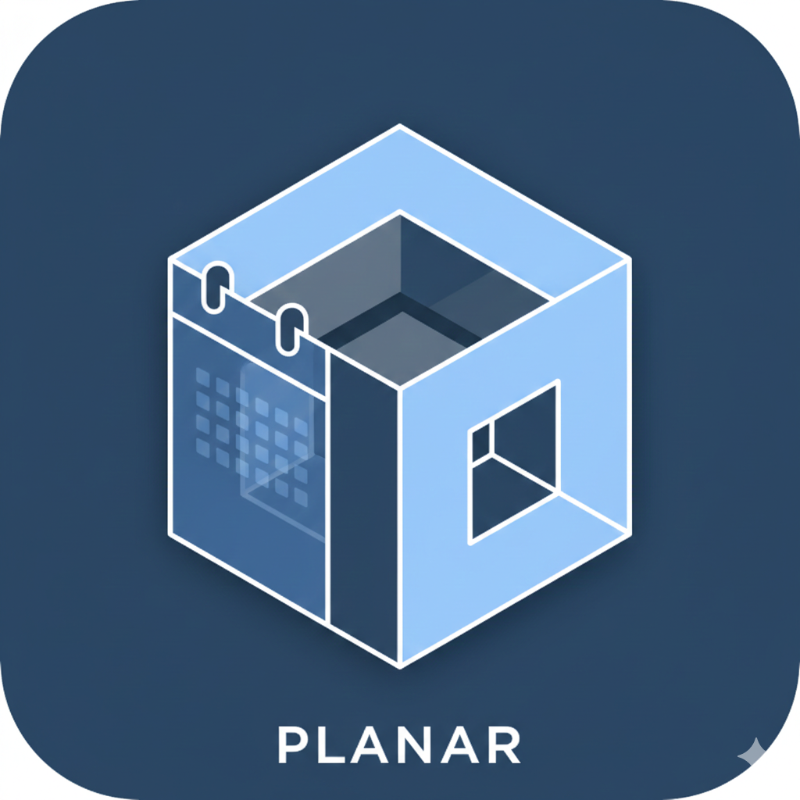
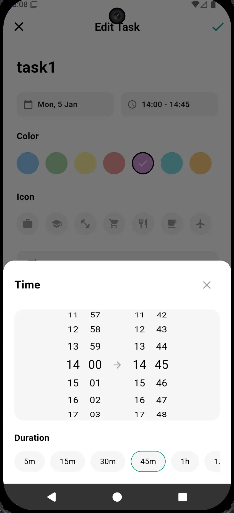
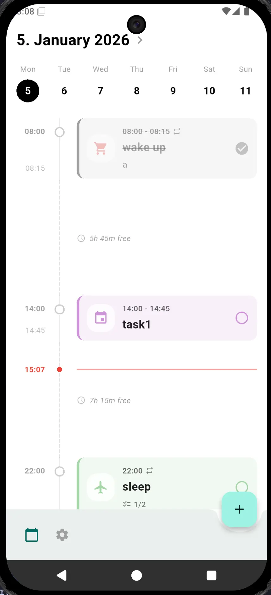
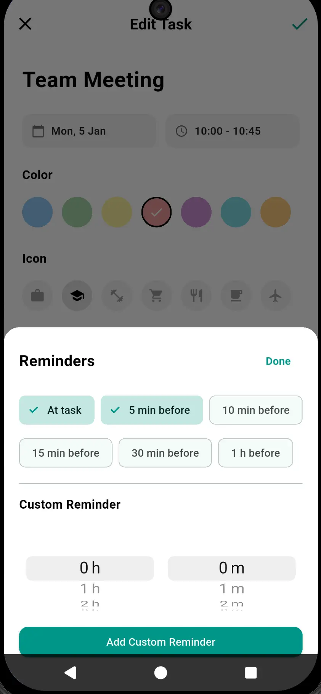

# Planar

<p align="center">
  
  <br>
  <a href="https://apps.obtainium.imranr.dev/redirect?r=obtainium://app/%7B%22id%22%3A%22com.slayernominee.planar%22%2C%22url%22%3A%22https%3A%2F%2Fgithub.com%2Fslayernominee%2Fplanar%22%2C%22author%22%3A%22slayernominee%22%2C%22name%22%3A%22Planar%22%2C%22preferredApkIndex%22%3A0%2C%22additionalSettings%22%3A%22%7B%5C%22includePrereleases%5C%22%3Afalse%2C%5C%22fallbackToOlderReleases%5C%22%3Atrue%2C%5C%22filterReleaseTitlesByRegEx%5C%22%3A%5C%22%5C%22%2C%5C%22filterReleaseNotesByRegEx%5C%22%3A%5C%22%5C%22%2C%5C%22verifyLatestTag%5C%22%3Afalse%2C%5C%22dontSortReleasesList%5C%22%3Atrue%2C%5C%22useLatestAssetDateAsReleaseDate%5C%22%3Afalse%2C%5C%22releaseTitleAsVersion%5C%22%3Afalse%2C%5C%22trackOnly%5C%22%3Afalse%2C%5C%22versionExtractionRegEx%5C%22%3A%5C%22%5C%22%2C%5C%22matchGroupToUse%5C%22%3A%5C%22%5C%22%2C%5C%22versionDetection%5C%22%3Atrue%2C%5C%22releaseDateAsVersion%5C%22%3Afalse%2C%5C%22useVersionCodeAsOSVersion%5C%22%3Afalse%2C%5C%22apkFilterRegEx%5C%22%3A%5C%22%5C%22%2C%5C%22invertAPKFilter%5C%22%3Afalse%2C%5C%22autoApkFilterByArch%5C%22%3Atrue%2C%5C%22appName%5C%22%3A%5C%22%5C%22%2C%5C%22shizukuPretendToBeGooglePlay%5C%22%3Afalse%2C%5C%22allowInsecure%5C%22%3Afalse%2C%5C%22exemptFromBackgroundUpdates%5C%22%3Afalse%2C%5C%22skipUpdateNotifications%5C%22%3Afalse%2C%5C%22about%5C%22%3A%5C%22%5C%22%7D%22%2C%22overrideSource%22%3Anull%7D">
  
  </a>
</p>

Planar is a sleek, high-performance open-source day planning application built with Flutter. It focuses on clarity, efficiency, and a seamless user experience, helping you visualize your day through an intuitive timeline view.

## 📱 Showcase

|  |  |  |  |

## ✨ Key Features

- **Interactive Timeline**: Visualize your day with a 24-hour vertical timeline featuring a moving "Current Time" indicator.
- **Dynamic Scheduling**: Tasks scale visually based on their duration, providing an immediate sense of your day's structure.
- **Recurring Tasks**: Sophisticated support for Daily, Weekly, and Monthly recurrences with smart series management (update "Only This", "This & Future", or "All").
- **Subtask Management**: Break down complex activities into actionable checklists within each task.
- **Multi-Reminder Notifications**: Schedule multiple alerts for any task (e.g., 30m before, 5m before, and at start) with a custom dual-wheel time picker.
- **Data Portability**: Full support for local JSON database export and import, allowing you to back up your schedule safely.
- **Gap Analysis**: Automatically calculates and displays "Free Time" windows between scheduled tasks.
- **Modern UI/UX**: A clean, Material 3 inspired interface with a focused light theme and smooth animations.

## 🛠 Tech Stack

- **Framework**: [Flutter](https://flutter.dev) (Dart)
- **State Management**: [Provider](https://pub.dev/packages/provider)
- **Database**: [SQLite](https://pub.dev/packages/sqflite) for local persistent storage
- **Utilities**: `intl` for localization, `uuid` for unique identification, and `file_picker` for data management.

## 🚀 Development

### Prerequisites

- Flutter SDK (latest stable version)
- Android Studio / Xcode (for mobile development)

### Installation

1. **Clone the repository**

   ```bash
   git clone https://github.com/slayernominee/planar.git
   cd planar
   ```

2. **Install dependencies**

   ```bash
   flutter pub get
   ```

3. **Run the app**
   ```bash
   flutter run
   ```

### Testing

```bash
flutter test
```

## 🔒 Signing

---

_For the development of this app, AI was heavily used._

_Planar is open-source and free to use. If you find it helpful, please consider giving it a star on [GitHub](https://github.com/slayernominee/planar)!_
